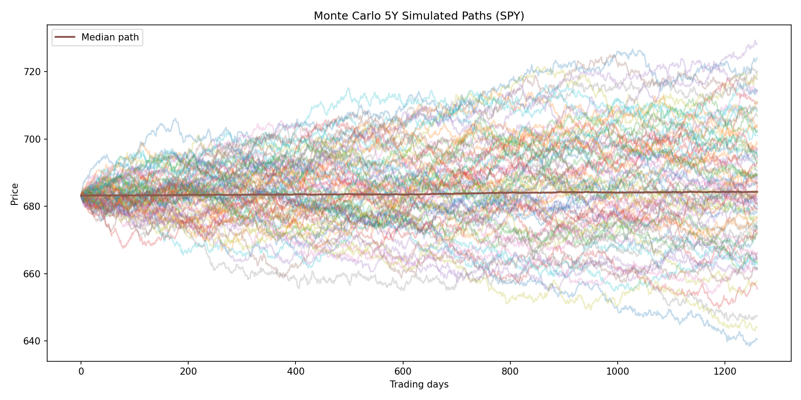

# Drawdown Risk Analysis

This project analyzes **downside risk and recovery dynamics** across major asset classes using a  
drawdown-centric framework.

Rather than relying on volatility, Sharpe ratios, or return moments, the analysis decomposes price  
series into **peak–trough–recovery events**, explicitly modeling **loss magnitude**, **loss duration**,  
and **time spent underwater**.

The objective is to quantify **tail risk, persistence, and path dependence** in a way traditional  
return-based metrics fail to capture.

---

## Methodology

For each asset, adjusted close prices are transformed into a drawdown series relative to the  
running historical peak. Drawdown events are defined as contiguous periods from peak to full  
recovery.

For each event, the following risk characteristics are extracted:

- **Maximum drawdown depth** (loss severity)
- **Peak-to-trough duration** (speed of collapse)
- **Trough-to-recovery duration** (recovery friction)
- **Total drawdown length** (time underwater)

This event-based framework separates **magnitude risk** from **temporal risk**, two dimensions  
that are largely orthogonal but equally relevant for portfolio construction and risk budgeting.

---

## Data

Daily adjusted close prices are sourced from Yahoo Finance for the following ETFs:

- **SPY** — US equities  
- **QQQ** — US growth equities  
- **IWM** — US small-cap equities  
- **TLT** — US long-duration Treasury bonds  
- **GLD** — Gold  

---

## Historical Risk Visualizations

### Drawdown Depth vs Time to Recovery

This scatter highlights the nonlinear relationship between loss severity and recovery time.  
Deep drawdowns are disproportionately associated with long recovery horizons.

### Drawdowns Over Time

Time-series drawdowns reveal structural differences in downside behavior across asset classes,  
particularly during systemic stress regimes.

---

## Monte Carlo Risk Analysis

### Monte Carlo 5Y Max Drawdown Distribution (SPY)

Using geometric Brownian motion calibrated to historical returns, Monte Carlo simulations estimate  
the distribution of **future maximum drawdowns** over a five-year horizon.

Reported tail metrics include:

- 1% worst-case drawdown  
- 5% drawdown  
- Median drawdown  

These quantities provide a probabilistic view of downside risk rather than a single-point estimate.

### Monte Carlo 5Y Simulated Paths (SPY)

Simulated price trajectories illustrate **path risk**: even when terminal returns are acceptable,  
intermediate drawdowns can be severe and prolonged.

---

## Key Findings

- Deeper drawdowns are associated with disproportionately longer recovery times.
- Small-cap equities exhibit the most extreme downside tail risk.
- Bonds and gold experience shallower drawdowns but materially longer recovery durations.
- Drawdown depth and recovery time capture **distinct risk dimensions** not reflected in volatility.
- Monte Carlo simulations highlight the prevalence of large interim losses even under benign return assumptions.

---

## Simulation Extension

Monte Carlo simulations using geometric Brownian motion are employed to estimate future drawdown  
distributions conditional on historical dynamics.

This provides a **forward-looking, distributional view of downside risk**, complementing the  
historical event-based analysis.
