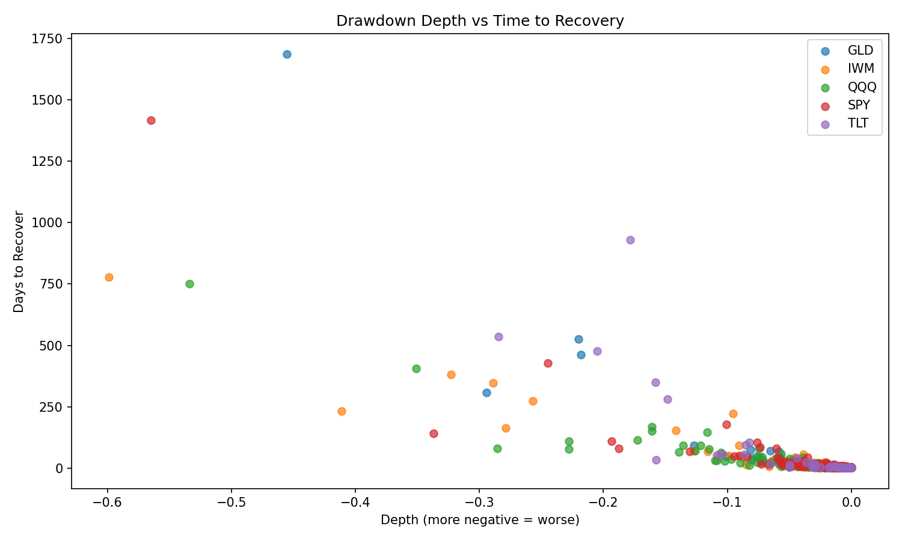
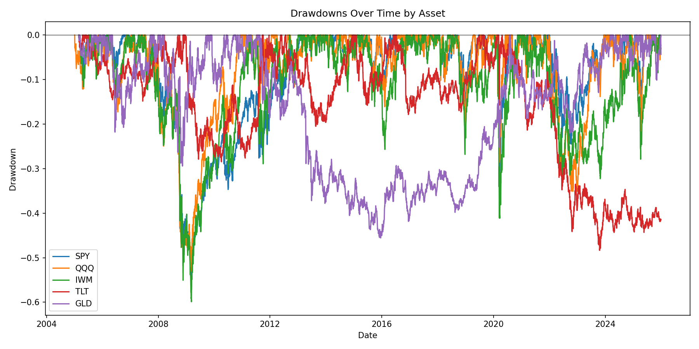
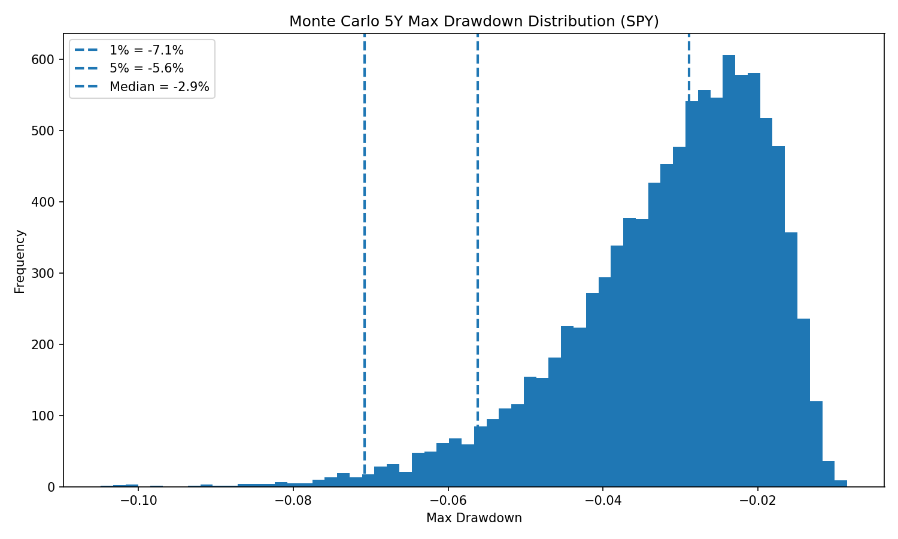

# Drawdown Risk Analysis

This project studies downside risk through a drawdown-based decomposition of asset price dynamics.
Rather than focusing on volatility or returns alone, the analysis identifies discrete **peak–trough–recovery**
events and characterizes both their **depth** and **time to recovery**.

The objective is to quantify tail risk and persistence across major asset classes, separating
*magnitude risk* from *temporal risk*.

## Methodology

For each asset, adjusted close prices are transformed into a drawdown series relative to the running peak.
Drawdown events are defined as contiguous periods from peak to full recovery, allowing extraction of:

- Maximum drawdown depth
- Peak-to-trough duration
- Trough-to-recovery duration
- Total drawdown length

This event-based framework captures risk dynamics that volatility-based measures ignore.

## Data

Daily adjusted close prices are sourced from Yahoo Finance for the following ETFs:

- **SPY** — US equities
- **QQQ** — US growth equities
- **IWM** — US small-cap equities
- **TLT** — US long-duration Treasury bonds
- **GLD** — Gold

## Figures

### Drawdown Depth vs Time to Recovery

### Drawdowns Over Time

### Monte Carlo 5Y Max Drawdown Distribution (SPY)

### Monte Carlo 5Y Max Drawdown (SPY)

## Key Findings

- Deeper drawdowns tend to exhibit longer recovery horizons, though the relationship is nonlinear.
- Small-cap equities display the largest downside tail risk.
- Bonds and gold experience shallower drawdowns but materially longer recovery times.
- Drawdown depth and recovery duration represent orthogonal dimensions of risk.

## Simulation Extension

Monte Carlo simulations using geometric Brownian motion are employed to estimate the
distribution of future drawdowns over a five-year horizon. This provides a probabilistic
assessment of downside risk conditional on historical return dynamics.
